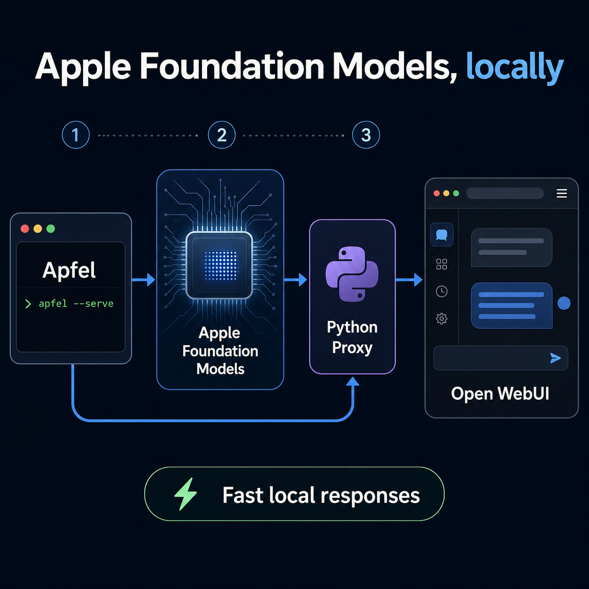

# Running Apple Foundation Models locally with Apfel and Open WebUI

I wanted to see how quickly I could work with Apple Foundation Models through a local, OpenAI-compatible API. This note records the setup I used, the point where the direct integration did not work for me, and the small proxy layer that connected everything.

> This is a record of one local setup, not a guarantee that every environment will behave the same way.

## 1. Install Apfel

```bash
brew install apfel
```

After installation, I first tried it from the terminal:

```bash
apfel "how are you?"
apfel "Write hello world program in java"
```

## 2. Start the local API server

Apfel can run as a local, OpenAI-compatible server:

```bash
apfel --serve
```

In my setup, this exposed the following endpoints:

```text
POST http://127.0.0.1:11434/v1/chat/completions
GET  http://127.0.0.1:11434/v1/models
GET  http://127.0.0.1:11434/health
```

Before connecting another tool, it is useful to confirm the service is live:

```bash
curl http://127.0.0.1:11434/health
curl http://127.0.0.1:11434/v1/models
```

## 3. Try Open WebUI

I ran Open WebUI in Docker and pointed its OpenAI-compatible base URL at the host machine:

```bash
docker run -d -p 3000:8080 \
  -e OPENAI_API_BASE_URL=http://host.docker.internal:11434/v1 \
  -e OPENAI_API_KEY=local \
  --name open-webui \
  ghcr.io/open-webui/open-webui:main
```

On macOS, `host.docker.internal` lets a container reach a service listening on the host. Once Open WebUI is running, open `http://localhost:3000` in a browser.

## 4. The integration gap

The direct Open WebUI-to-Apfel connection was not reliable in my environment. Rather than trying to change either application, I added a small Python proxy.

The proxy accepted the API shape expected by the UI, forwarded the request to the Apfel server, and returned the backend response. It became a narrow compatibility layer between the UI and the local model server.

```text
Open WebUI  →  Python proxy  →  Apfel  →  Apple Foundation Models
```

This was intentionally lightweight: the proxy exists only to make the local integration dependable, not to become another model platform.

## Result

With the proxy in place, I had a local chat experience backed by Apple Foundation Models and exposed through a familiar OpenAI-compatible interface. The responses felt fast, and the overall stack stayed on my machine.

## Takeaway

The interesting part was not only that Apfel exposed a local API. It was that a very small adapter was enough to bridge the gap between a local model server and a UI designed for OpenAI-style backends.


